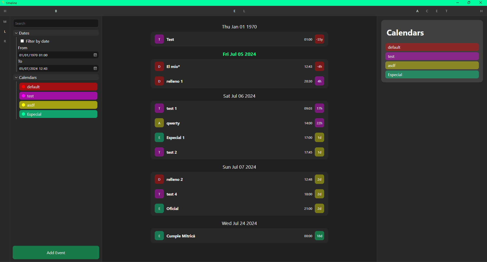
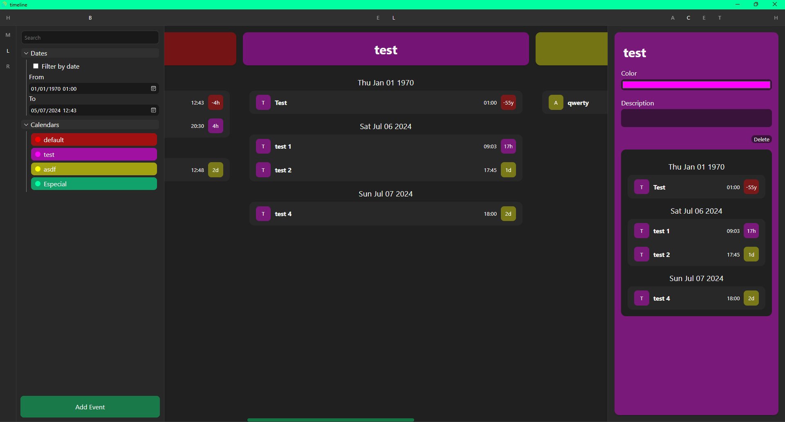
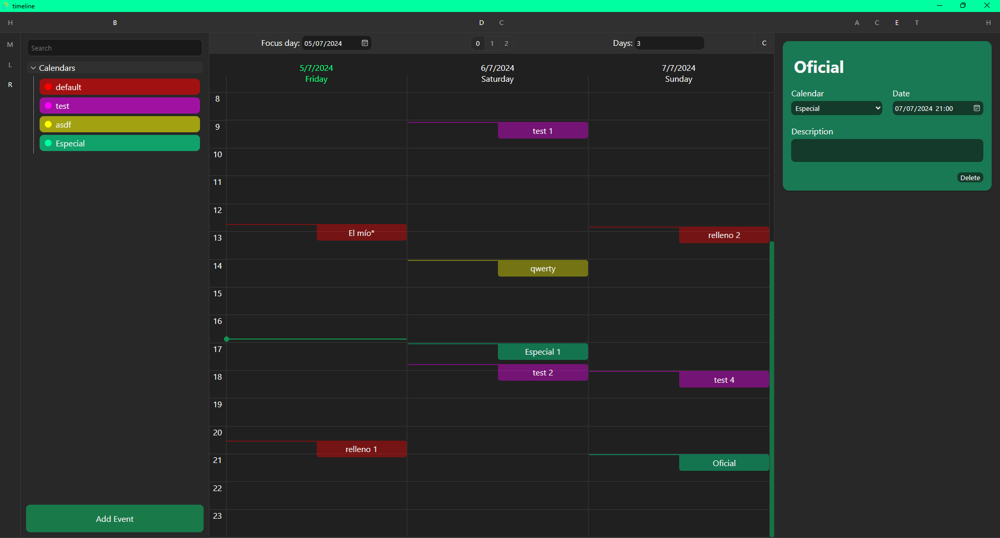
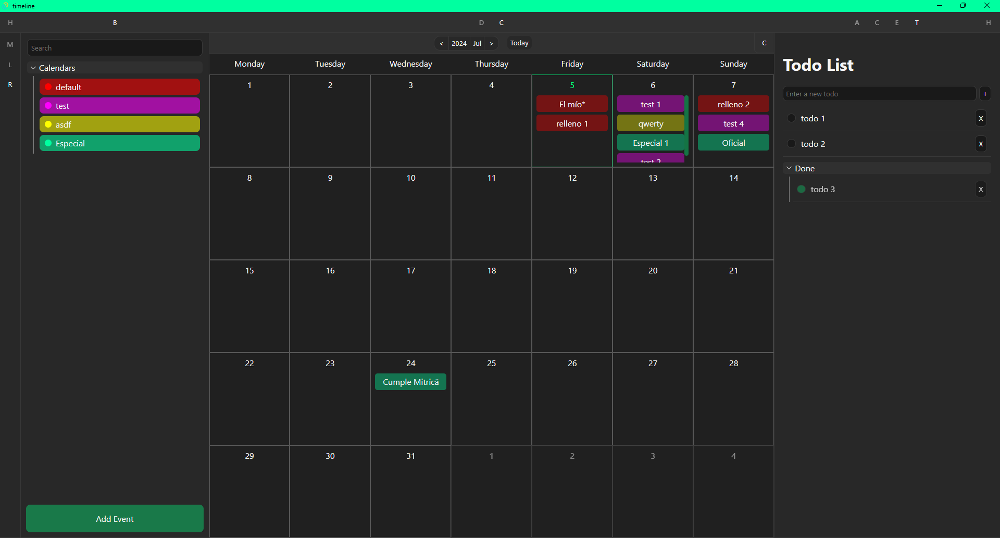
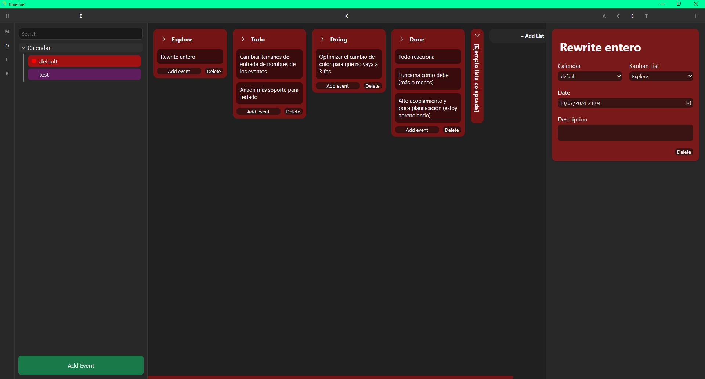

# Timeline

Una aplicación simple para organización.
Es una excusa para aprender Svelte y cómo gestiona la reactividad. Se ha hehco un poco sobre la marcha, por lo que no se ha planificado bien.
Puede que en algún momento se haga un rewrite.

---

# Estructura

La aplicación tiene una barra en la izquierda en la que se puede cambiar de modo.

La parte principal consta de 3 secciones en las que cambia el contenido libremente:
- Barra lateral
- Pestaña principal
- Detalles

---

# Ventanas:

## 1. Lista de eventos:

## 2. Bloques de calendario:

## 3. Varios días

## 4. Calendario

## 5. Kanban

---

# Tauri + Svelte + Typescript

## Recommended IDE Setup

[VS Code](https://code.visualstudio.com/) + [Svelte](https://marketplace.visualstudio.com/items?itemName=svelte.svelte-vscode) + [Tauri](https://marketplace.visualstudio.com/items?itemName=tauri-apps.tauri-vscode) + [rust-analyzer](https://marketplace.visualstudio.com/items?itemName=rust-lang.rust-analyzer).
